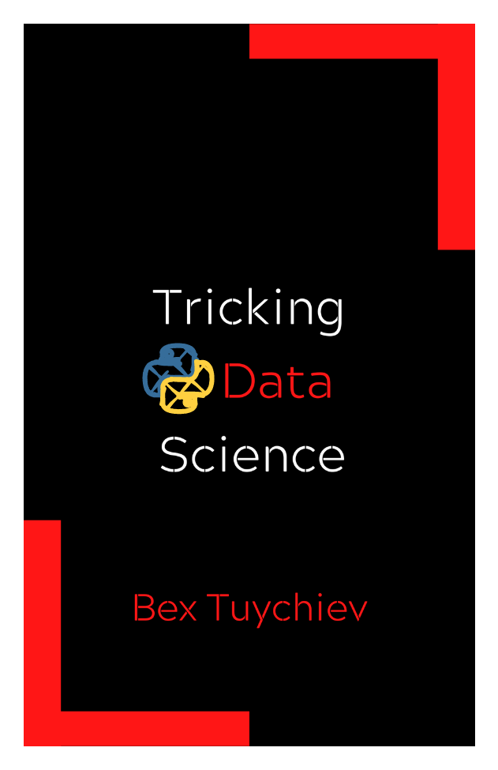

    <h1 align="center">Tricking Data Science</h1>

 

  

    Subtle code tricks and gem resources for all things data, machine learning and deep learning.
  

<h2>A book with no commitment</h2>
It starts with my dislike of bookmarks. As a programmer, you often come across a neat
little code trick on StackOverflow or blogs by some elite senior, and say, "Hey, I gotta
save this." You bookmark the page, and a day later you forget the bookmark's name. A week
later, you even forget that it existed in the first place.

But in your mind, you always have that fuzzy reference knowledge that there is some really
cool way of doing this one task, but you can't really put your finger on it. All
programmers experience this, and we all have different ways of dealing (or not dealing)
with it. Well, this book is **my** way of dealing with it.

*Tricking Data Science* is a collection of code tricks, titbits of advice and curated
resources that I picked up during the two years I have been writing about data science on
Medium. Until I got recommended to the Jupyter Book project, there was no right way for me
to organize such a collection but now, here it goes.

<h2>Don't ever reinvent the wheel</h2>

There is only one loose requirement for a certain code trick to be added to this book:
It should perform a task in a short and concise way that most people don't know about and
thus, waste their time reinventing the wheel. Today's languages and packages have been in
use for such a long time now that there is always the best and shortest way of doing
something. It is just a matter of looking in the right place. I hope this book will be
that *right place* for many.

<h2>Don't shy away...</h2>
This is an open-source book, not an exclusive property of mine. If you have a trick or
a resource of your own, create a pull request and give me the great satisfaction of accepting
my very first! With your permission, I will add the trick to the book using Snappify—the
tool I used for those interactive code blocks and
maybe share it on LinkedIn.

<h2>About the author</h2>

Here goes the semi-formal introduction of **ME** in the third person 😁

Bex Tuychiev is an undergraduate student studying business analytics (or something close
to it) in Uzbekistan. He writes articles on data science, machine learning and statistics
for the Medium publication [Towards Data Science](https://towardsdatascience.com/).
With over 120 articles written, he currently ranks as one of the Top 10 all time Medium
writers in the topic of Artificial Intelligence among 180k writers. Oh, and he is also a
Kaggle Master and DataCamp instructor.

You can reach him for a chat or a sponsored article
on [LinkedIn](https://www.linkedin.com/in/bextuychiev/), where he posts the
contents of this book daily. Make sure your connection request has a custom message,
otherwise, he just ignores them (yes, that sounds arrogant, but he isn't - at least, he
hopes) 😉

<h2>Support the author</h2>

Medium: Become a member
through [my affiliate link](https://ibexorigin.medium.com/membership).

Tip me: [Ko-fi](https://ko-fi.com/bextuychiev).

Follow: [Medium](https://ibexorigin.medium.com/)
, [LinkedIn](https://www.linkedin.com/in/bextuychiev/)
, [Twitter](https://twitter.com/BexTuychiev), [GitHub](https://github.com/BexTuychiev)
, [Kaggle](https://www.kaggle.com/bextuychiev)

###### Ⓒ Tricking Data Science
